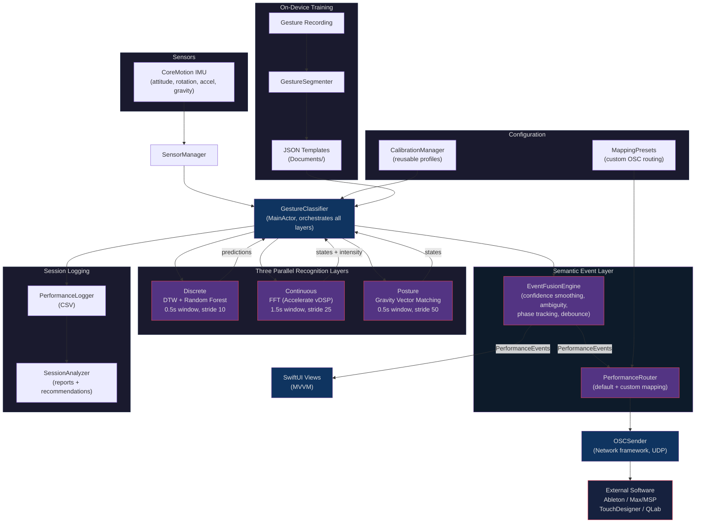

# Kinetic

iOS gesture controller for live music performance. Turns iPhone motion data into OSC messages over UDP using three parallel recognition layers.

## What It Does

Hold your phone on stage and Kinetic translates your movements into control signals for any OSC-compatible software (Ableton, Max/MSP, TouchDesigner, QLab, etc.).

- **Discrete gestures** -- chops, flicks, punches detected via DTW + Random Forest
- **Continuous gestures** -- shaking, arm circles detected via FFT frequency analysis
- **Postures** -- phone orientations (vertical, flat, tilted) detected via gravity vector matching

All three layers run simultaneously on the same IMU stream. Train gestures on-device with no external tools or data collection.

## Requirements

- iOS 17.0+
- Xcode 16+ / Swift 6
- No external dependencies (CoreMotion, Network, Accelerate, CoreML only)

## Build & Run

```bash
xcodebuild -project Kinetic.xcodeproj -scheme Kinetic -destination 'generic/platform=iOS'
```

Run tests:

```bash
xcodebuild test -project Kinetic.xcodeproj -scheme Kinetic \
  -destination 'platform=iOS Simulator,name=iPhone 17 Pro' \
  -only-testing:KineticTests
```

Note: IMU sensors are not available in the simulator. Deploy to a physical device for full functionality.

## Training Gestures

1. Open the Gesture Library and tap **+** to create a new gesture
2. Choose a type: **Discrete**, **Continuous**, or **Posture**
3. Record training samples:
   - *Discrete*: hold the record button and perform the gesture. Multiple recordings improve accuracy.
   - *Continuous*: perform the motion for 10 seconds. The app extracts a frequency profile automatically.
   - *Posture*: hold the phone in position for 3 seconds.
4. Adjust per-gesture **sensitivity** to fine-tune detection thresholds

## OSC Output

Default prefix: `/kinetic/` (configurable in Settings)

| Address | Type | Description |
|---|---|---|
| `.../attitude/quat` | 4 floats | Device orientation quaternion |
| `.../rotation/rate` | 3 floats | Gyroscope x/y/z |
| `.../accel/user` | 3 floats | User acceleration x/y/z |
| `.../gravity` | 3 floats | Gravity vector x/y/z |
| `.../gesture/[name]` | float | Discrete gesture probability (>0.3) |
| `.../gesture/[name]/trigger` | int | Discrete trigger with velocity (debounced) |
| `.../gesture/[name]/state` | int | Continuous/posture on/off (on transitions) |
| `.../gesture/[name]/intensity` | float | Continuous gesture intensity 0--1 (while active) |

Configure the target IP and port in the Settings tab.

## Architecture

MVVM + SwiftUI with Swift 6 strict concurrency. Three classification layers run on background queues. A semantic event layer fuses classifier outputs into typed `PerformanceEvent` objects before routing to OSC, UI, and logging.



### Recognition Layers
- **Discrete** (0.5s window, stride 10) -- DTW distance matching + Random Forest probability, per-gesture debounce cooldown
- **Continuous** (1.5s window, stride 25) -- FFT via Accelerate vDSP, hysteresis state machine (idle -> candidate -> active -> cooldown -> idle)
- **Posture** (0.5s window, stride 50) -- gravity vector angle matching with low-pass filter, activation/deactivation hysteresis

### Semantic Event Layer
Raw classifier outputs are fused into `PerformanceEvent` objects by `EventFusionEngine`. Each event carries a lifecycle phase (candidate, active, release, cooldown, ambiguous, suppressed), smoothed confidence, intensity, latency, and competing gesture info. `PerformanceRouter` maps events to OSC output -- default routing preserves the standard schema, custom `MappingPreset` routes support latch, envelope, and macro actions.

### Calibration Profiles
`CalibrationManager` stores reusable calibration presets with reference attitude, per-gesture sensitivity and cooldown overrides, and energy gate tuning. Profiles can be captured from current state and applied before performances.

Session logging records CSV files on-device with built-in analysis: trigger counts, latency percentiles, and actionable tuning recommendations.

## Privacy

No analytics or tracking. Motion data stays on-device. The only network traffic is user-configured OSC output to a local IP.

## License

All rights reserved.
